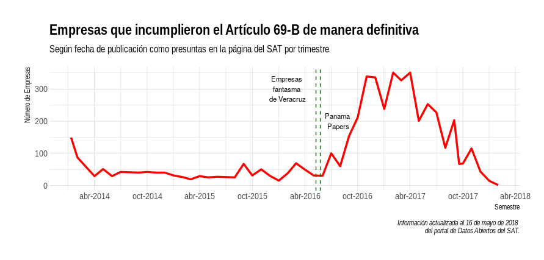

# Objetivo

Hola! En este repo llevaremos registro de los avances, notas y ayuda que recibamos para LCD en **MECATE**.

# ¿Qué es LCD?

LCD es una proyecto que busca establecer relaciones entre personas y empresas con una serie de bases de datos con el fin de encontrar potenciales redes de corrupción.

# ¿Qué contiene este repositorio?

En este repositorio se recolectan los resultados de las jornadas de discusión y análisis de **MECATE**.

# Problemas

Durante las tres primeras rondas del primer día de **MECATE** se han identificado una serie de problemas. Los que fueron mencionados más frecuentemente fueorn los siguientes:

1. Extraer nombres de empresas y personas del cuerpo de las notas de *Animal Político*.
2. Procesar información de las *ASF* en PDF.
3. Mejorar la experiencia de usuario.
4. Definir los procesos específicos.

# Diagnósticos

